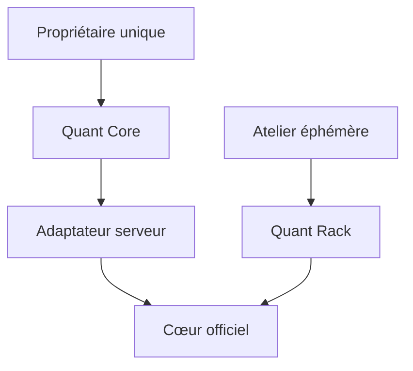

# Architecture actuelle

## Chemin déployé

Le Compose lance l'interface et le cœur sur `quant-network`. Le port interne 8080 n'est jamais publié sur l'hôte. La console passe exclusivement par son adaptateur serveur authentifié ; les identifiants internes et les secrets de marché ne rejoignent jamais le navigateur.

Quant Rack se place au-dessus de la configuration du cœur. Il sélectionne un profil, publie son budget et ses modules, puis applique une modification atomique avec sauvegarde et retour arrière. Il ne remplace ni la boucle de décision, ni les ordres, ni la persistance.

| Couche du rack | Intégration | Coût permanent |
|---|---|---:|
| Profil | Stratégie, timeframe, paires, indicateurs, protections et budget dans un JSON validé | Négligeable |
| Activation | `rackctl` traduit le profil, sauvegarde la configuration, recharge et vérifie l'état | Aucun hors activation |
| Recherche | `researchctl` lance backtest, benchmark, anti-biais, récursif et OOS dans `strategy-lab` | Aucun hors job |
| Observation | `observectl` effectue un relevé ponctuel puis disparaît | Aucun démon ajouté |
| Interface | Lit l'état du cœur, du rack et le résumé 7 jours via des routes serveur | Next.js uniquement |

## Réalité d'implémentation

| Zone | État | Source |
|---|---|---|
| Authentification console | Compte personnel unique, cookie signé, aucun PIN ou rôle | `console/pages/api/auth.ts` |
| Positions, capital et performances | Lecture réelle, cache court, dernier état sain borné | `console/pages/api/bot/control.ts` |
| Validation stratégie | Backtest, lookahead, récursif et OOS sous un verrou unique | `scripts/researchctl.py` |
| Logs | Lecture des derniers événements réels, texte limité | `console/pages/api/bot/logs.ts` |
| Indicateurs de marché décoratifs | Supprimés ; aucun calcul doublonné dans l'UI | — |
| Identifiants exchange / Telegram | Non collectés par la console, injectés au moteur | Secrets serveur / Coolify |
| Stratégie de base | Recherche spot 15m, non validée | `strategies/QuantCoreBaseline.py` |
| Stratégie Ichimoku | Modernisée depuis le fichier fourni, non validée | `strategies/IchiV1Research.py` |
| Quant Rack | Profils et état lisible par la console | `quant_rack/`, `scripts/rackctl.py` |
| Orchestrateur FastAPI | Prototype non déployé, à supprimer après vérification d'absence de dépendance | `orchestrator/` |

## Coffre de déploiement

Les secrets exchange et Telegram vivent uniquement dans le gestionnaire de secrets Coolify. Le Compose les transmet directement au moteur avec les variables imbriquées `FREQTRADE__EXCHANGE__*` et `FREQTRADE__TELEGRAM__*`, qui prennent priorité sur le JSON. Next.js ne les lit pas et ne les renvoie jamais au navigateur.

## Frontière produit

La porte d'entrée ne révèle aucune technologie ni finalité métier avant authentification. Après connexion, la cabine affiche les données opérationnelles et l'état du rack. Cette discrétion ne remplace pas la sécurité : le compte personnel, le cookie `HttpOnly`, le réseau privé et les secrets serveur restent obligatoires.
