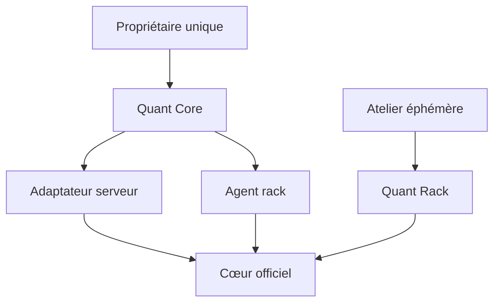

# Architecture actuelle

## Chemin déployé

Le Compose lance l'interface et le cœur sur `quant-network`. Le port interne 8080 n'est jamais publié sur l'hôte. La console passe exclusivement par son adaptateur serveur authentifié ; les identifiants internes et les secrets de marché ne rejoignent jamais le navigateur.

Quant Rack se place au-dessus de la configuration du cœur. Il sélectionne un profil, publie son budget et ses modules, puis applique une modification atomique avec sauvegarde et retour arrière. Il ne remplace ni la boucle de décision, ni les ordres, ni la persistance.

### Agent rack (pont de privilège pour la console)

La console n'a jamais eu, et n'a toujours pas, d'accès en écriture à `user_data/config.json` ni de socket Docker : c'est le cloisonnement volontaire qui limite les dégâts d'une console compromise. Pour permettre malgré tout un sélecteur de profil dans l'UI, un service supplémentaire — `rack-agent` — encapsule `rackctl` derrière une API HTTP interne :

- toujours démarré (`restart: unless-stopped`), jamais publié sur l'hôte, joignable uniquement depuis `quant-network` ;
- authentifié par un jeton porteur dédié (`QUANT_RACK_AGENT_TOKEN`), distinct de tous les autres secrets ;
- n'expose que trois opérations : lister les profils, lire l'état, déployer un profil (`rackctl deploy <profil> --confirm DRY-RUN`) — appelle directement les fonctions de `rackctl.py`, sans réimplémenter ses garde-fous (dry-run obligatoire, refus si positions ouvertes, sauvegarde + `reload_config` + vérification de santé + retour arrière automatique, verrou mono-vol, journal d'audit).

Compromis assumé : une console compromise peut désormais aussi changer la stratégie/timeframe actifs (toujours borné au dry-run, toujours refusé si des positions sont ouvertes, toujours journalisé). Elle ne peut pas retirer de fonds, activer le mode réel, ni sortir du périmètre déjà couvert par un profil Quant Rack.

| Couche du rack | Intégration | Coût permanent |
|---|---|---:|
| Profil | Stratégie, timeframe, paires, indicateurs, protections et budget dans un JSON validé | Négligeable |
| Activation | `rackctl` traduit le profil, sauvegarde la configuration, recharge et vérifie l'état | Aucun hors activation |
| Recherche | `researchctl` lance backtest, benchmark, anti-biais, récursif et OOS dans `strategy-lab` | Aucun hors job |
| Observation | `observectl` effectue un relevé ponctuel puis disparaît | Aucun démon ajouté |
| Interface | Lit l'état du cœur, du rack et le résumé 7 jours via des routes serveur | Next.js uniquement |

## Réalité d'implémentation

| Zone | État | Source |
|---|---|---|
| Authentification console | Compte personnel unique, cookie signé, aucun PIN ou rôle | `console/pages/api/auth.ts` |
| Positions, capital et performances | Lecture réelle, cache court, dernier état sain borné | `console/pages/api/bot/control.ts` |
| Validation stratégie | Backtest, lookahead, récursif et OOS sous un verrou unique | `scripts/researchctl.py` |
| Logs | Lecture des derniers événements réels, texte limité | `console/pages/api/bot/logs.ts` |
| Indicateurs de marché décoratifs | Supprimés ; aucun calcul doublonné dans l'UI | — |
| Identifiants exchange / Telegram | Non collectés par la console, injectés au moteur | Secrets serveur / Coolify |
| Stratégie de base | Recherche spot 15m, non validée | `strategies/QuantCoreBaseline.py` |
| Stratégie Ichimoku | Modernisée depuis le fichier fourni, non validée | `strategies/IchiV1Research.py` |
| Quant Rack | Profils et état lisible par la console | `quant_rack/`, `scripts/rackctl.py` |
| Activation depuis l'UI | Sélecteur de profil dans le tableau de bord, borné au dry-run | `console/pages/api/rack/activate.ts`, `scripts/rack_agent.py` |
| Ancienne couche SaaS | Supprimée : aucun tenant, abonnement, paiement ou plan de contrôle parallèle | — |

## Coffre de déploiement

Au premier démarrage, le Compose peut importer les anciennes variables Coolify Exchange et Telegram dans `user_data/private/runtime-secrets.json`. Ensuite, la console authentifiée modifie ce second fichier de configuration avec des permissions `0600`, sans jamais renvoyer ses valeurs au navigateur. Freqtrade le charge après `config.json`, conformément à son mécanisme de configurations multiples. Une mise à jour déclenche `reload_config` et restaure la version précédente si le moteur la refuse.

## Frontière produit

La porte d'entrée ne révèle aucune technologie ni finalité métier avant authentification. Après connexion, la cabine affiche les données opérationnelles et l'état du rack. Cette discrétion ne remplace pas la sécurité : le compte personnel, le cookie `HttpOnly`, le réseau privé et les secrets serveur restent obligatoires.
