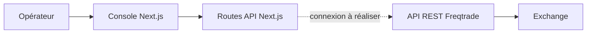

# Architecture actuelle

## Chemin déployé

Le Compose lance `trading-terminal` et `freqtrade-engine` sur `quant-network`. Le moteur expose le port 8080 uniquement à l'intérieur de ce réseau.

Quant Rack se place au-dessus de la configuration Freqtrade. Il sélectionne un profil, publie son budget et prépare un changement atomique ; il ne remplace ni la boucle de trading, ni l'exchange, ni la base de données.

## Réalité d'implémentation

| Zone | État | Source |
|---|---|---|
| Authentification console | Fonctionnelle, secrets obligatoires | `console/pages/api/auth.ts` |
| Marché Binance | API publique avec repli simulé | `console/pages/api/market/*` |
| Positions et commandes | Simulation en mémoire | `console/pages/api/bot/control.ts` |
| Validation stratégie | Procédure CLI, aucun résultat fabriqué | `scripts/strategy-check.sh` |
| Logs | Flux SSE simulé | `console/pages/api/bot/logs.ts` |
| Identifiants exchange / Telegram | Non collectés par la console, injectés au moteur | Secrets serveur / Coolify |
| Stratégie de base | Recherche spot 15m, non validée | `strategies/QuantCoreBaseline.py` |
| Stratégie Ichimoku | Modernisée depuis le fichier fourni, non validée | `strategies/IchiV1Research.py` |
| Quant Rack | Profils et état lisible par la console | `quant_rack/`, `scripts/rackctl.py` |
| Orchestrateur FastAPI | Prototype séparé | `orchestrator/` |

## Coffre de déploiement

Les secrets exchange et Telegram vivent uniquement dans le gestionnaire de secrets Coolify. Le Compose les transmet directement au moteur avec les variables imbriquées `FREQTRADE__EXCHANGE__*` et `FREQTRADE__TELEGRAM__*`, qui prennent priorité sur le JSON. Next.js ne les lit pas et ne les renvoie jamais au navigateur.

## Cible suivante

Créer un module serveur unique `FreqtradeClient` qui gère authentification REST, délais, erreurs, validation des réponses et journalisation sans secrets. Les routes Next.js devront déléguer à ce module au lieu de modifier des objets en mémoire. L'interface ne pourra afficher « live » qu'après confirmation d'une source réelle.
